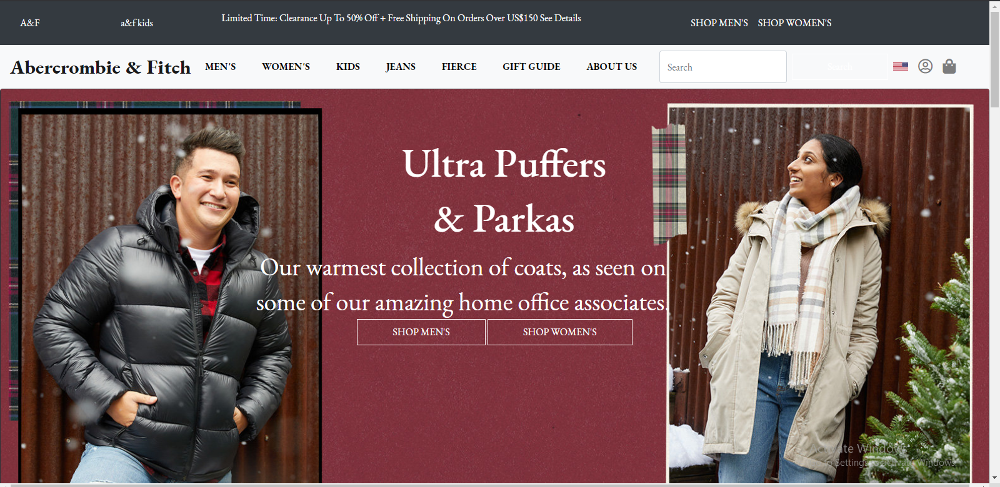

# Abercrombie.com-clone

## About The Project
This project is about creating a website using bootstrap framework. the website is built to be responsive to different screen sizes, and certain features are hidden for some mobile views

## Image

## Built With
* CSS
* HTML

## Author
* Ezekiel Ogunniwa
  * Github: https://github.com/Eminentzeal
  * linkedin: https://www.linkedin.com/in/ogunniwaezekiel/
  * Twitter: https://twitter.com/Ogunniwaezekiel

## Facilitators
* [Godwin Nwachukwu](https://github.com/Gnwin).

* [Chioma Nwachukwu](https://github.com/Chiomy).

## Acknowledgements
* HomeFrontStartup
  * http://homefrontstartup.com.ng/
* Mentors International
  * https://mentorsint.com/
  * https://www.facebook.com/mentorshubyola/
  * https://twitter.com/hub_mic
  * https://www.linkedin.com/company/michub/

## Live Demo
  [See project live here](https://eminentezekiel-abercrombie-clone.netlify.app/)

## Source site
  [Abercrombie](https://www.abercrombie.com).

#### 🤝 Contributions
  * This project is open to your comments and contributions, kindly reach the author through the above author's social media handles.

  